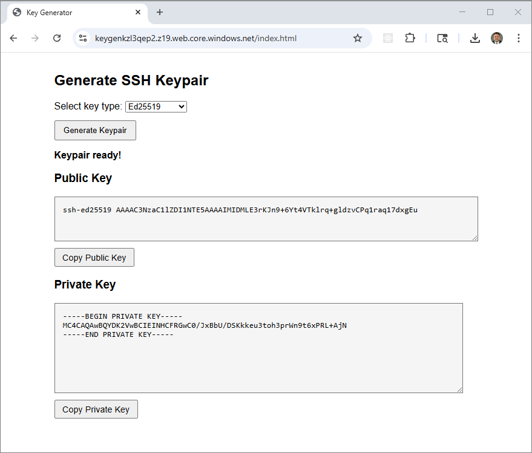
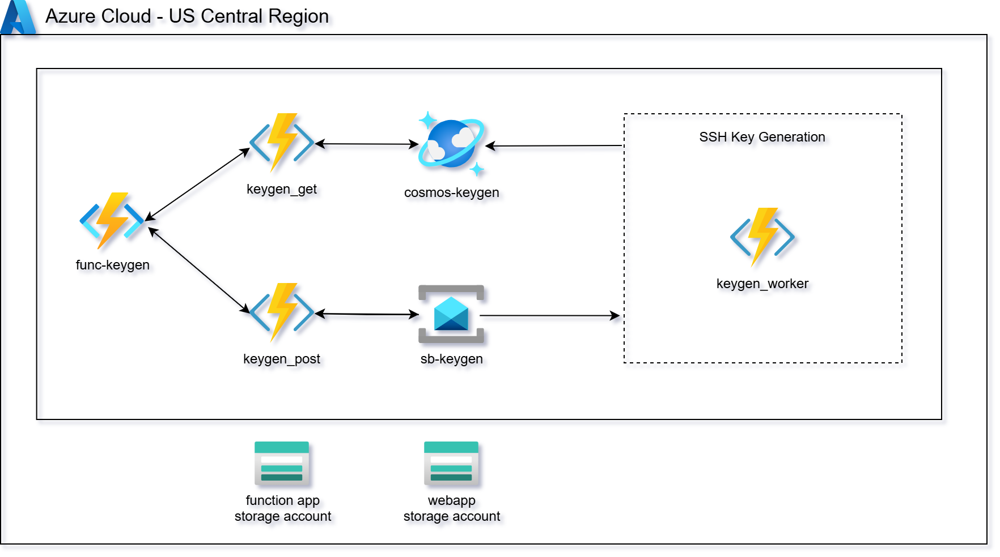
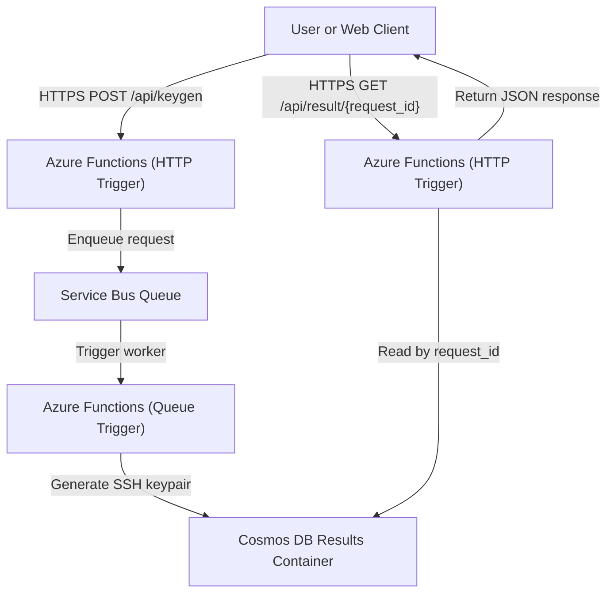

# Azure SSH KeyGen Microservice 

This project delivers a fully automated **serverless SSH key generation service**
on **Microsoft Azure**, built using **Azure Service Bus**, **Azure Functions
(Python)**, **Azure Cosmos DB**, and an **Azure Function App / HTTP endpoints**.

It uses **Terraform** and **Python (azure-sdk + cryptography)** to implement a
**message-driven, asynchronous key generation pipeline** that processes SSH
keypair requests without requiring any virtual machines or long-running
infrastructure.

Requests are submitted via an HTTP API, queued through Service Bus, processed by
a background Azure Function, and written to Cosmos DB for retrieval using a
unique `request_id`.

For testing this service, a simple HTML frontend lets users trigger key generation requests directly from a browser using the deployed API endpoints.



This design follows a **stateless, event-driven microservice architecture**:
Functions scale automatically on demand, keys are generated entirely in memory,
and results expire automatically—ensuring low cost, strong isolation, and
minimal operational overhead.

Key capabilities demonstrated:

1. **Serverless Key Generation Pipeline** – Fully event-driven workflow using
   Service Bus queues, Azure Functions, and Cosmos DB.
2. **Asynchronous Processing Model** – Clients submit jobs via HTTP and poll for
   results using a correlation ID.
3. **Secure Key Handling** – SSH keypairs are generated in memory only and stored
   temporarily in Cosmos DB, base64-encoded for safe transport.
4. **Infrastructure as Code (IaC)** – Terraform provisions Service Bus, Cosmos
   DB, Function Apps, Storage Accounts, identities, and supporting resources.
5. **Optional Static Web Client** – A lightweight HTML frontend hosted on Azure
   Storage enables browser-based testing of the API endpoints.

Together, these components form a **cloud-native, serverless DevOps utility**
suitable for CI/CD pipelines, ephemeral environments, demos, or short-lived
development workflows.



## HTTP API Endpoints

The **KeyGen API** exposes two HTTP endpoints through **Azure Functions (HTTP
triggers)**, providing a simple request/response workflow for asynchronous SSH
key generation.  
All endpoints return structured JSON and are designed to integrate seamlessly
with both CLI tools and browser-based clients.

Internally, requests are enqueued to **Azure Service Bus**, processed by a
background Function, and persisted temporarily in **Azure Cosmos DB**.

### POST /api/keygen

**Purpose:**  
Submits a new SSH key generation request to the service.  
The request is placed on a Service Bus queue and processed asynchronously by a
queue-triggered Azure Function.

**Request Body (JSON):**
```json
{
  "key_type": "rsa",
  "key_bits": 2048
}
```

**Parameters:**
| Field | Type | Required | Description |
|-------|------|-----------|-------------|
| `key_type` | string | No | Type of key to generate (`rsa` or `ed25519`). Defaults to `rsa`. |
| `key_bits` | integer | No | RSA key size (`2048` or `4096`). Ignored for Ed25519 keys. |

**Example Request:**
```bash
curl -X POST https://<function-app>.azurewebsites.net/api/keygen \
  -H "Content-Type: application/json" \
  -d '{"key_type": "rsa", "key_bits": 2048}'
```

**Example Response:**
```json
{
  "request_id": "630f70c4-815c-41d1-ae52-6babf3a41b1f",
  "status": "submitted"
}
```

**Behavior:**
- The API immediately returns a unique `request_id` for correlation.  
- The actual key generation occurs asynchronously in a queue-triggered Function.  
- Clients must poll the `/api/result/{request_id}` endpoint to retrieve results.

### GET /api/result/{request_id}

**Purpose:**  
Retrieves the result of a previously submitted SSH key generation request.

**Path Parameters:**
| Parameter | Type | Description |
|------------|------|-------------|
| `request_id` | string | Unique ID returned by the `/api/keygen` call. |

**Example Request:**
```bash
curl https://<function-app>.azurewebsites.net/api/result/630f70c4-815c-41d1-ae52-6babf3a41b1f
```

**Example Response (Pending):**
```json
{
  "request_id": "630f70c4-815c-41d1-ae52-6babf3a41b1f",
  "status": "pending"
}
```

**Example Response (Completed):**
```json
{
  "request_id": "630f70c4-815c-41d1-ae52-6babf3a41b1f",
  "status": "complete",
  "key_type": "rsa",
  "key_bits": 2048,
  "public_key_b64": "LS0tLS1CRUdJTiBSU0EgUFVCTElDIEtFWS0tLS0t...",
  "private_key_b64": "LS0tLS1CRUdJTiBSU0EgUFJJVkFURSBLRVktLS0tLQo..."
}
```

**Status Values:**
| Status | Description |
|---------|--------------|
| `submitted` | Request accepted and queued for processing. |
| `pending` | Request is being processed by the Service Bus worker. |
| `complete` | Key generation successful; keypair included in response. |
| `error` | Request failed; additional error message provided. |

---

**Notes:**
- Responses are served by Azure Functions backed by Cosmos DB lookups.  
- SSH keys are generated entirely in memory and stored temporarily, base64-encoded.  
- Cosmos DB TTL automatically expires results, ensuring security and cost control.

### Architecture Flow



## Prerequisites

* [An Azure Account](https://portal.azure.com/)
* [Install AZ CLI](https://learn.microsoft.com/en-us/cli/azure/install-azure-cli) 
* [Install Latest Terraform](https://developer.hashicorp.com/terraform/install)

If this is your first time watching our content, we recommend starting with this video: [Azure + Terraform: Easy Setup](https://www.youtube.com/watch?v=j4aRjgH5H8Q). It provides a step-by-step guide to properly configure Terraform, Packer, and the AZ CLI.

## Download this Repository

```bash
git clone https://github.com/mamonaco1973/aws-sqs-keygen.git
cd aws-sqs-keygen
```

## Build the Code

Run [check_env](check_env.sh) to validate your environment, then run [apply](apply.sh) to provision the infrastructure.

```bash
azureuser@develop-vm:~/azure-sb-keygen$ ./check_env.sh
NOTE: Validating that required commands are found in your PATH.
NOTE: az is found in the current PATH.
NOTE: terraform is found in the current PATH.
NOTE: jq is found in the current PATH.
NOTE: zip is found in the current PATH.
NOTE: All required commands are available.
NOTE: Validating that required environment variables are set.
NOTE: ARM_CLIENT_ID is set.
NOTE: ARM_CLIENT_SECRET is set.
NOTE: ARM_SUBSCRIPTION_ID is set.
NOTE: ARM_TENANT_ID is set.
NOTE: All required environment variables are set.
NOTE: Logging in to Azure using Service Principal...
NOTE: Successfully logged into Azure.
Initializing the backend...
```

### Build Results

When the deployment completes, the following resources are created:

- **Core Infrastructure:**  
  - Fully serverless architecture—no virtual machines or long-running compute required  
  - Terraform-managed provisioning of Azure Functions, Service Bus, Cosmos DB, Storage, and monitoring resources  
  - Event-driven message pipeline enabling asynchronous SSH key generation and result retrieval  

- **Identity & Security:**  
  - System-assigned Managed Identity for Azure Functions with least-privilege RBAC access  
  - Secure access from Functions to Service Bus and Cosmos DB without secrets or keys  
  - Optional encryption-at-rest using Azure-managed keys for Service Bus and Cosmos DB  
  - SSH keys generated entirely in memory with no local file persistence  

- **Azure Service Bus Queue:**  
  - Dedicated request queue for inbound SSH key generation jobs  
  - Decouples HTTP request submission from background key processing  
  - Provides durability, retry handling, and back-pressure for Function workers  

- **Azure Cosmos DB:**  
  - Central results container keyed by unique `request_id`  
  - Stores request status, key metadata, and base64-encoded keypair output  
  - Configured with Time-to-Live (TTL) for automatic expiration and cost control  

- **Azure Functions (Python):**  
  - HTTP-triggered Functions for submitting requests and retrieving results  
  - Queue-triggered Function for asynchronous SSH key generation  
  - Supports RSA-2048, RSA-4096, and Ed25519 key types via request payload  
  - Emits structured logs and metrics to Azure Monitor and Application Insights  

- **HTTP API Layer:**  
  - HTTPS endpoints exposed directly via Azure Functions (`/api/keygen`, `/api/result/{request_id}`)  
  - Stateless request handling suitable for browser clients and CLI integrations  
  - JSON-based request/response model aligned with REST-style workflows  

- **Static Web Application (Azure Storage):**  
  - Storage account configured for static website hosting  
  - `index.html` frontend allows users to submit key requests and poll for results  
  - Dynamically calls Azure Function endpoints published as Terraform outputs  

- **Automation & Validation:**  
  - `apply.sh`, `destroy.sh`, and `check_env.sh` scripts automate provisioning, teardown, and environment validation  
  - Terraform enforces consistent, repeatable deployments across environments  
  - Entire workflow runs using Azure CLI authentication, Terraform, and Python—no manual setup required  

Together, these resources form a **serverless, event-driven SSH KeyGen pipeline**
on Azure, demonstrating cloud-native design principles with automatic scaling,
strong security boundaries, and minimal operational overhead.
