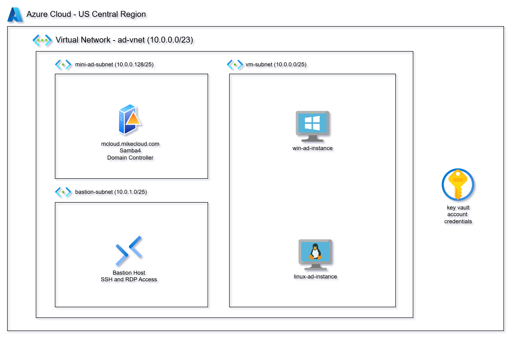
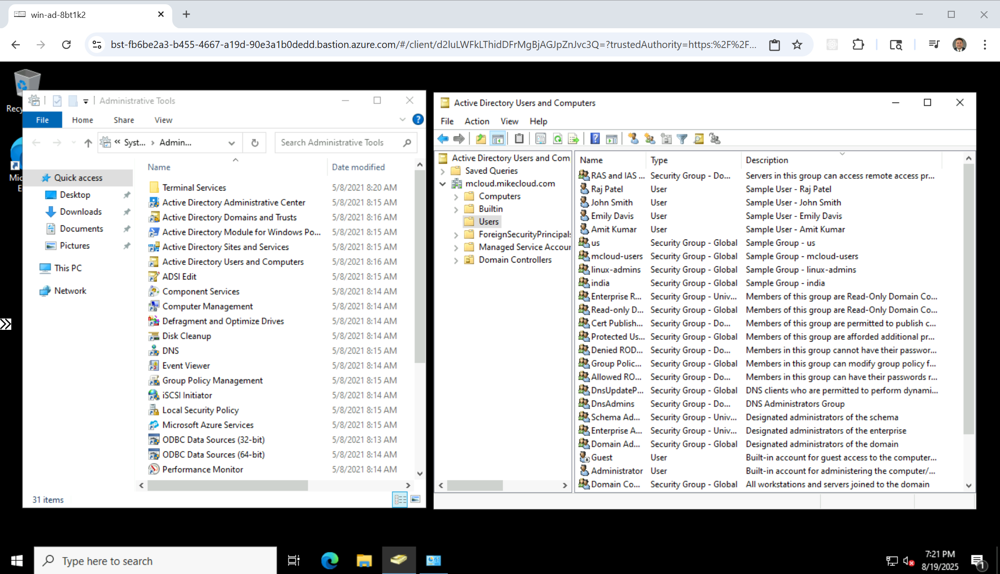
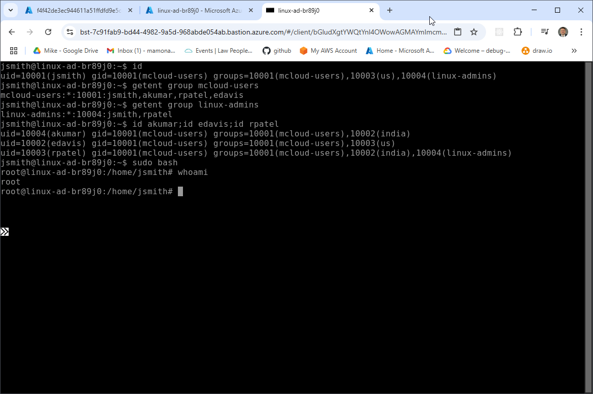

# Azure Mini Active Directory

This project is a follow-up to our full **Azure Active Directory Domain Services (AADDS)** project. While managed AD services are well-suited for production, they can be expensive for prototyping and require long provisioning times. The **“mini-ad”** approach provides a faster, lower-cost alternative that delivers a fully functional Active Directory environment that builds much quicker.

Using **Terraform, Samba 4, and automated configuration scripts**, this deployment provisions an **Ubuntu-based Azure VM** acting as both a **Domain Controller and DNS server**. It integrates into a custom **Azure Virtual Network (VNet)** with secure subnets, **Network Security Groups (NSGs)**, **Azure Bastion** for remote access, and **Azure Key Vault** for credential management. Additional **Windows and Linux VMs** are deployed and automatically join the domain at boot, enabling seamless AD authentication across platforms.  

This solution is ideal for **labs, demos, and development environments** where Active Directory integration is needed without the cost and provisioning time of Azure AD Domain Services. It is **not intended for production use**, but provides a complete, repeatable environment for testing AD-connected workloads in Azure.  

See the `Limitations` sections for a list of caveats.

---




## Limitations  

While the mini-AD deployment provides a functional and cost-effective Active Directory environment for labs, demos, and development, it does not include many of the advanced features found in **Azure AD Domain Services** or **Windows Server AD on Azure**:  

### Issues Related to PaaS vs IaaS (Operational & Platform-Level)  
- **High Availability & Multi-Region** – Managed AD provisions redundant DCs automatically; mini-AD is a single VM.  
- **Automated Backups & Snapshots** – Managed AD handles backups; mini-AD requires manual snapshots or Recovery Services Vault.  
- **Automatic Patching** – Managed AD auto-patches OS and AD services; mini-AD requires manual updates.  
- **Security Hardening & Compliance** – Managed AD is pre-hardened for Azure compliance; mini-AD depends on your configuration.  
- **24/7 Microsoft Support** – Managed AD includes support; mini-AD requires you to manage everything.  
- **Monitoring & Metrics** – Managed AD integrates with Azure Monitor; mini-AD requires manual monitoring setup.  

### Functional Differences (AD Feature Gaps & Compatibility)  
- **Azure Service Integration** – Managed AD integrates with AVD, FSLogix, SQL MI, and more; mini-AD requires extra setup.  
- **Group Policy Objects (GPOs)** – Managed AD supports full GPOs; Samba GPO support is limited and lacks replication.  
- **PowerShell AD Cmdlets** – Managed AD supports AD Web Services; Samba mini-AD lacks native cmdlet support.  
- **Kerberos Trusts with On-Prem AD** – Managed AD supports trusts; mini-AD requires manual Kerberos/LDAP configuration.  
- **No Entra ID Support** – Mini-AD cannot integrate with Microsoft Entra ID (Azure AD). This prevents seamless single sign-on (SSO), conditional access, and direct integration with Microsoft 365 or modern identity-driven security features, which limits its usefulness in hybrid identity scenarios.  

---

## Prerequisites  

* [An Azure Account](https://portal.azure.com/)
* [Install AZ CLI](https://learn.microsoft.com/en-us/cli/azure/install-azure-cli) 
* [Install Latest Terraform](https://developer.hashicorp.com/terraform/install)

If this is your first time watching our content, we recommend starting with this video: [Azure + Terraform: Easy Setup](https://www.youtube.com/watch?v=wwi3kVgYNOk). It provides a step-by-step guide to properly configure Terraform, Packer, and the AZ CLI.

---

## Download this Repository  

```bash
git clone https://github.com/mamonaco1973/azure-mini-ad.git
cd azure-mini-ad
```  

---

## Build the Code  

Run [check_env](check_env.sh) to validate your environment, then run [apply](apply.sh) to provision the infrastructure.  

```bash
develop-vm:~/azure-mini-ad$ ./apply.sh
NOTE: Validating that required commands are in PATH.
NOTE: az is found in the current PATH.
NOTE: terraform is found in the current PATH.
NOTE: All required commands are available.
NOTE: Checking Azure CLI connection.
NOTE: Successfully logged into Azure.
Initializing provider plugins...
Terraform has been successfully initialized!
```  

---

### Build Results  

When the deployment completes, the following resources are created:  

- **Networking:**  
  - A VNet with public and private subnets  
  - Azure Bastion for secure RDP/SSH without public IPs  
  - Route tables configured for AD and client communication  

- **Security & Identity:**  
  - NSGs for domain controller, Linux client, and Windows client  
  - Azure Key Vault for credential storage (admin + user accounts)  
  - Managed Identities for VM-to-Key Vault secret retrieval  

- **Active Directory Server:**  
  - Ubuntu VM running Samba 4 as Domain Controller and DNS server  
  - Configured Kerberos realm and NetBIOS name  
  - Administrator credentials stored in Key Vault  

- **Client Instances:**  
  - Windows VM joined to the domain via boot-time PowerShell script  
  - Linux VM joined to the domain with SSSD integration via custom-data script  

---

### Users and Groups  

The domain controller provisions **sample users and groups** via Terraform templates. These are intended for testing and demonstration.  

#### Groups Created  

| Group Name    | Category  | Scope     | gidNumber |
|---------------|-----------|----------|-----------|
| mcloud-users  | Security  | Universal | 10001 |
| india         | Security  | Universal | 10002 |
| us            | Security  | Universal | 10003 |
| linux-admins  | Security  | Universal | 10004 |

#### Users Created  

| Username | Full Name   | uidNumber | gidNumber | Groups Joined                    |
|----------|-------------|-----------|-----------|----------------------------------|
| jsmith   | John Smith  | 10001     | 10001     | mcloud-users, us, linux-admins   |
| edavis   | Emily Davis | 10002     | 10001     | mcloud-users, us                 |
| rpatel   | Raj Patel   | 10003     | 10001     | mcloud-users, india, linux-admins|
| akumar   | Amit Kumar  | 10004     | 10001     | mcloud-users, india              |

---

### Log into Windows Instance  

When the Windows instance boots, the [ad_join script](02-servers/scripts/ad_join.ps1.template) executes the following tasks:  

- Install Active Directory Administrative Tools  
- Install AWS CLI  
- Join EC2 instance to Active Directory  
- Grant RDP access to domain users  
- Perform a final system reboot  

Administrator credentials are stored in the `admin_ad_credentials` secret.



---

### Log into Linux Instance  

When the Linux instance boots, the [custom data script](02-servers/scripts/custom_data.sh) runs the following tasks:  

- Update OS and install required packages  
- Install AWS CLI  
- Join the Active Directory domain with SSSD  
- Enable password authentication for AD users  
- Configure SSSD for AD integration  
- Grant sudo privileges to the `linux-admins` group  

Linux user credentials are stored as secrets.



---


---

### Clean Up  

When finished, remove all resources with:  

```bash
./destroy.sh
```  

This uses Terraform to delete the VNet, VMs, Key Vault, storage accounts, NSGs, and secrets.  

---

⚠️ **Reminder:** This project is for **labs and development only**. Do not use it in production.  
